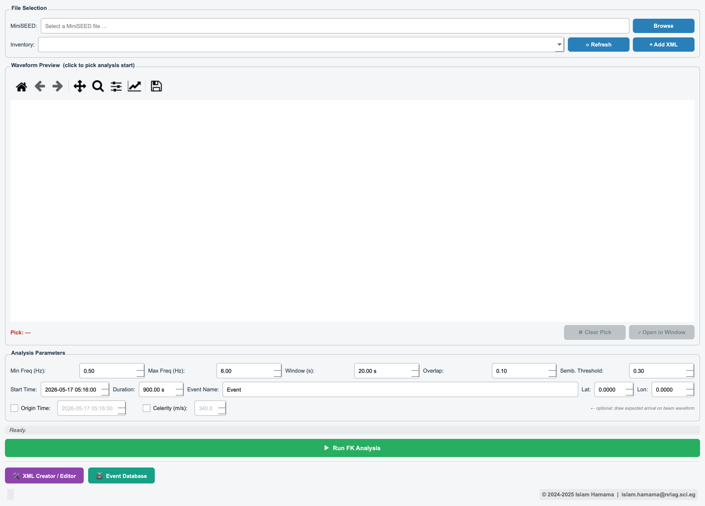
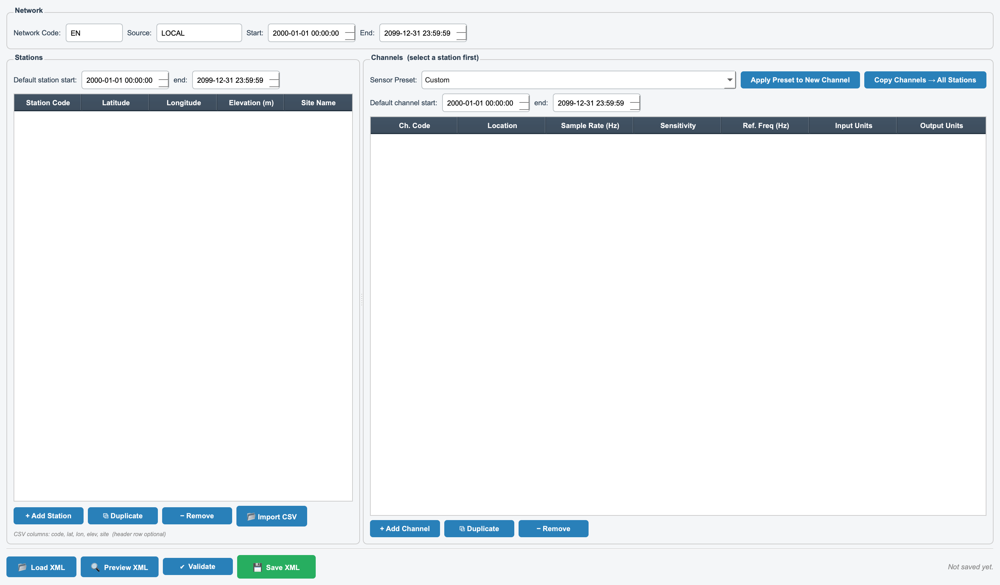
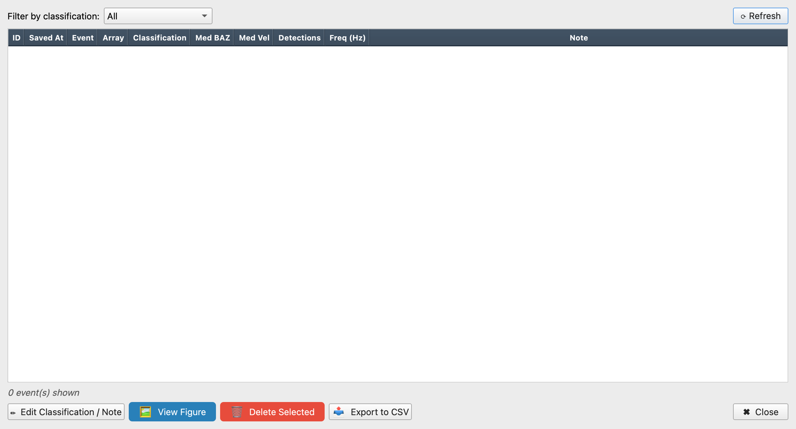

# SeismoFK

**SeismoFK** is a desktop application for **frequency–wavenumber (FK) array analysis** of infrasound and seismic array data. It provides an interactive PyQt5 interface for loading MiniSEED waveforms, removing instrument response, running FK / beamforming array processing, visualising the results, and archiving classified events in a local database.

---

## What is FK array analysis?

When a wave (an infrasound signal, a seismic phase, an explosion's acoustic arrival) crosses an **array** of closely spaced sensors, it reaches each element at a slightly different time. By measuring those tiny time delays across the array, FK (frequency–wavenumber) analysis estimates two key properties of the incoming wavefield:

- **Back-azimuth** — the direction the signal arrives *from*.
- **Apparent (trace) velocity** / **slowness** — how fast the wavefront sweeps across the array, which constrains the wave type and the elevation angle of arrival.

SeismoFK runs FK analysis in sliding time windows and reports, per window, the **semblance** (a 0–1 measure of how coherently the array sees the signal), the **Fisher ratio**, the **FK power**, the estimated **back-azimuth**, and the **apparent velocity**. It also forms a **delay-and-sum beam** steered to the dominant detected direction, and compares the measured back-azimuth against the back-azimuth expected from a user-supplied source location.

SeismoFK is built primarily for **infrasound array monitoring** — for example, analysing data from CTBTO/IMS infrasound arrays or local arrays such as HLW (Helwan, Egypt) — but the underlying processing works for any sensor array with appropriate station metadata.

---

## Features

- **Interactive PyQt5 desktop GUI** — no scripting required for routine analysis.
- **MiniSEED loading** — open one or several MiniSEED files; traces are merged automatically.
- **Station inventory management** — auto-discovers StationXML files on startup and lets you add more from the GUI.
- **Full instrument-response removal** via ObsPy, with a scalar-sensitivity fallback when full response data is unavailable.
- **Waveform preview with click-to-pick** — click the preview plot to set the FK analysis start time; open a larger waveform viewer for closer inspection.
- **FK / beamforming array processing** (built on `obspy.signal.array_analysis.array_processing`) reporting semblance, Fisher ratio, FK power, back-azimuth, slowness and apparent velocity per window.
- **Delay-and-sum beam** steered to the dominant detected back-azimuth and apparent velocity.
- **Expected back-azimuth** computed from a user-supplied source latitude/longitude for direct comparison with the measurement.
- **Optional event physics** — supply a known origin time and a celerity (typical infrasound range ~300–360 m/s) to overlay the expected infrasound arrival on the beam waveform.
- **Mixed sampling-rate handling** — traces at different sample rates are resampled to a common rate before processing.
- **Results window** with high-resolution figure export (300 DPI; PNG / PDF / SVG).
- **Event database** — classify and archive each analysis in a local SQLite database (`fk_events.db`), with a built-in browser to review, edit and delete records, and CSV export. The analysis figure is stored alongside the metadata.
- **Built-in XML Creator / Editor** — define custom station arrays interactively without hand-writing StationXML.
- **CSV output** — each FK run also writes an `Output_<event>.csv` table of per-window results.
- **Spectrogram utility** (`plot_spectrogram_window.py`) for supplementary signal inspection.

---

## Screenshots

| Main analysis window | XML Creator / Editor | Event database |
|---|---|---|
|  |  |  |

---

## Prerequisites

- **Python 3.9 or newer** (3.10+ recommended).
- A desktop environment capable of running Qt applications (Windows, macOS, or Linux with a display server).

### Key dependencies

| Package | Version | Purpose |
|---|---|---|
| PyQt5 | `>=5.15, <6.0` | Desktop GUI |
| NumPy | `>=1.24` | Numerical processing |
| pandas | `>=2.0` | Tabular results / CSV output |
| matplotlib | `>=3.7` | Plotting (Qt5Agg backend) |
| ObsPy | `>=1.4` | MiniSEED I/O, StationXML, response removal, array processing |

> The spectrogram utility additionally uses **SciPy** (`scipy.signal`). If you intend to use `plot_spectrogram_window.py`, install SciPy as well (`pip install scipy`).

---

## Installation

```bash
# 1. Clone the repository
git clone https://github.com/islam-hamama/SeismoFK.git
cd SeismoFK_v1

# 2. (Recommended) create and activate a virtual environment
python -m venv .venv
source .venv/bin/activate        # Windows: .venv\Scripts\activate

# 3. Install dependencies
pip install -r requirements.txt
```

---

## Running SeismoFK

The application entry point is **`Infra_Analysis.py`**:

```bash
python Infra_Analysis.py
```

This opens the main **SeismoFK — Infrasound FK Array Analysis** window.

> For a full, step-by-step walkthrough of every panel and tool, see **[USAGE.md](USAGE.md)**.

### Typical workflow

1. **Load data** — click *Browse* and select one or more MiniSEED files.
2. **Select an inventory** — choose a station XML from the *Inventory* dropdown (see the station-metadata section below).
3. **Pick a start time** — click the waveform preview to set the FK analysis start time, or set it manually.
4. **Set parameters** — minimum/maximum frequency, FK window length, window overlap, semblance threshold, analysis duration, event name, and the expected source latitude/longitude. Optionally enable *Origin Time* and *Celerity* to overlay the expected infrasound arrival.
5. **Run FK Analysis** — processing runs in a background thread (response removal → filtering → FK array processing → beamforming).
6. **Review results** — the results window shows the FK detections, the steered beam, and the array geometry. Export the figure at 300 DPI if needed.
7. **Save to database** — classify the event (explosion, mining, volcanic, microbaroms, etc.) and archive it, with the figure, in the local SQLite database.

---

## Station metadata (XML inventories)

This repository does **not** include station XML files. IMS infrasound station metadata is subject to CTBTO/IRIS data-distribution policies and cannot be redistributed. The local HLW (Helwan) station file is also not bundled.

**You can supply your own.** Two options:

1. Run `python convert_ims.py` against your own `all_IMS_sts.xml` (FDSN StationXML) to generate per-station files in `XML_IM/`.
2. Use the built-in **XML Creator** tool (`xml_creator.py`) to define custom stations interactively.

Place generated files in `XML/` or `XML_IM/` next to `Infra_Analysis.py`; the app auto-discovers them on startup.

### How auto-discovery works

On startup (and whenever you click *⟳ Refresh*), SeismoFK scans two directories next to `Infra_Analysis.py` and populates the *Inventory* dropdown:

- **`XML_IM/`** — intended for IMS / multi-station array inventories. If this directory contains any `.xml` files, a single **"★ All IMS Stations (XML_IM/)"** entry is added first; selecting it loads and merges *every* `.xml` file in the directory into one combined inventory. Each individual file in `XML_IM/` is also listed separately, tagged `[IMS]`.
- **`XML/`** — for individual / custom station files. Each `.xml` file is listed as its own entry.

If neither directory exists the app warns that no inventory was found. The **+ Add XML** button copies a chosen StationXML file into `XML/` and refreshes the list. When an entry that points to a *directory* is selected, SeismoFK merges all the XML files in that directory at analysis time.

> **Note:** `convert_ims.py` currently uses absolute input/output paths defined at the top of the file (`SRC_FILE` and `OUT_DIR`). Review and adjust them for your environment before running it.

---

## Supporting tools and modules

| File | Role |
|---|---|
| `Infra_Analysis.py` | Main application and GUI entry point. |
| `fk_analysis.py` | Core FK / beamforming routines (`fk_array`, `compute_beam`, inventory loading, coordinate lookup). |
| `xml_creator.py` | Standalone StationXML Creator / Editor — also launchable from the main window. Supports multi-station arrays, per-channel sensitivity, sensor presets, loading/editing existing XMLs and CSV import. |
| `convert_ims.py` | Converts a combined `all_IMS_sts.xml` FDSN StationXML into one XML file per IMS station in `XML_IM/`. |
| `export_stations.py` | Alternative IMS station splitter that exports individual stations from `all_IMS_sts.xml`. |
| `db_manager.py` | SQLite persistence layer for archived events (`fk_events.db`), including the event classification vocabulary and schema. |
| `plot_spectrogram_window.py` | Standalone spectrogram plotting utility for supplementary signal inspection. |

The **XML Creator** can also be opened directly:

```bash
python xml_creator.py
```

---

## Output files

- **`Output_<event>.csv`** — per-window FK results (time, semblance, FK power, Fisher ratio, back-azimuth, apparent velocity, slowness), written for each analysis run.
- **`fk_events.db`** — local SQLite database of archived, classified events (created on first save).
- Exported figures — PNG / PDF / SVG at 300 DPI, saved on demand from the results window.

---

## License

Released under the **MIT License** — see [LICENSE](LICENSE).

> **Note for review:** the bundled `LICENSE` file currently lists a placeholder copyright holder. Update it to match the source headers (which credit *Islam Hamama, 2024–2025*) before the public launch.

---

## Citing SeismoFK

If you use SeismoFK in your research, please cite it. Citation metadata is provided in [`CITATION.cff`](CITATION.cff) (Citation File Format 1.2.0); GitHub renders this as a *"Cite this repository"* button.

[](https://doi.org/10.5281/zenodo.20301796)

---

## Author

**Islam Hamama**
National Research Institute of Astronomy and Geophysics (NRIAG), Egypt
Contact: islam.hamama@nriag.sci.eg

### Acknowledgements

The array-processing methodology in `fk_analysis.py` is adapted in part from work by **Jelle Assink** (KNMI) — see the [ROSES 2021 array processing material](https://github.com/roseseismo/roses2021/blob/main/unit08/array_processing.py).
