# SeismoFK — v1.2.1

**SeismoFK** is a desktop application for **frequency–wavenumber (FK) array analysis** of infrasound data. It provides an interactive PyQt5 interface for loading MiniSEED waveforms, removing instrument response, running FK / beamforming array processing, visualising the results, and archiving classified events in a local database.

---

## New in v1.2.1

This release adds modern array-analysis methods — now reachable **both** from the
GUI and as importable modules / a batch CLI — and polishes the GUI results figure.
The conventional-FK run pipeline is unchanged; the new methods are additive.

- **High-resolution adaptive beamforming** — Capon / MVDR and MUSIC slowness
  estimators alongside the classical Bartlett (conventional FK), with much
  sharper slowness peaks and better separation of close/multiple arrivals
  (`fk_analysis.fk_beamform`; in the GUI via **Slowness map · Capon / MUSIC**).
- **PMCC detector with families** — multi-band, triplet-consistency detection
  pixels with least-squares slowness (`pmcc.pmcc`). Pixels that are adjacent in
  time and frequency and agree in back-azimuth and trace velocity are grouped
  into **families**, one per coherent arrival (`pmcc.pmcc_families`). Each
  pixel and family carries a **95% confidence interval** for back-azimuth and
  trace velocity from an arrival-time error model. In a development study on
  180 noisy synthetic plane waves the family intervals contained the true
  values 98–100% of the time; the regression test requires at least 85% on 16
  cases. The intervals have **not yet been validated against ground-truth
  field events**, and they don't include model errors such as wavefront
  curvature, topography or wind shear. Families in which the direction
  changes, which usually means two merged sources, are flagged. Grouping uses
  single linkage, so nearby sources can still chain into one family: the flag
  reduces this risk but doesn't guarantee separation. A family
  is the detection product used for bulletins, with its time span, frequency
  range, back-azimuth ± spread and velocity. In the GUI, use the **PMCC
  detector** button (families are shaded and listed, and can be exported); the
  CLI archives them under `families/`.
- **Noise levels** — time-domain RMS level of every sensor in consecutive
  windows (seconds to an hour, 1 min by default) in **dB re 20 µPa**, with the
  acoustic statistics L90 / L50 / L10 and Leq (a power average). Each sensor
  is compared with the median of the others and flagged as a warning at 3 dB
  or a fault at 6 dB (gain or metadata errors, wind-noise-reducer faults).
  Hour-of-day medians show the diurnal wind cycle. In the GUI, use the
  **Noise levels** button; for long records, `seismofk-cli --method noise`.
- **Bootstrap uncertainty** — back-azimuth / apparent-velocity confidence
  intervals and a slowness-space confidence ellipse (`fk_analysis.bootstrap_beam`;
  in the GUI via the **“Estimate uncertainty (bootstrap)”** checkbox, which adds
  `baz ± σ` / `vel ± σ` to the results title and a marker on the polar map).
- **Array Response Function** — theoretical ARF for the current geometry, showing
  spatial aliasing and slowness resolution (`fk_analysis.array_response`; in the
  GUI via **Array response**).
- **Long-term batch CLI** (`seismofk_cli.py`) — stream an arbitrary time range in
  chunks and archive detections to a **Parquet** table + **JSON** metadata
  sidecar + master `index.csv`, ideal for months/years of continuous data. It
  indexes files *headers-only* and loads **one chunk at a time**, so peak memory
  scales with `--chunk`, not total duration — a year-long run won’t exhaust RAM,
  and an interrupted run keeps every completed chunk. Before processing, it
  runs the same readiness checks as the GUI (`--check-only` to run just those),
  skips chunks with too many missing samples (`--max-gap`), and records each
  chunk's status, calibration units and gap fraction in `index.csv`.
  `--method fk` runs the GUI's conventional FK pipeline, and
  `--save-figures` writes a figure for every chunk plus a whole-run summary
  without needing a display. For `fk` the figure is the GUI's six-panel figure;
  for the other methods it shows the waveform plus detections.
- **Results-figure layout fixes** — the semblance colorbar and polar plot title
  have separate space, and the expected back-azimuth is labeled in the figure
  heading without crowding the array geometry panel.
- **Result windows** — FK, slowness, array response, and PMCC views use a shared
  desktop layout with readable summaries and figure export controls, and the
  spectrogram, waveform picker, event database and readiness dialogs share the
  same style. The FK beam axis shows the units read from StationXML
  (Pa for infrasound sensors, m/s for seismometers, or raw counts).
- **Spectrogram reliability** — short picked windows use enough time slices to
  show a signal; missing pressure calibration falls back to clearly labeled
  raw-count PSD instead of leaving the plot blank. Picked spectrograms use the
  main **Duration** rather than the short FK window, with adjustable smoothing.
- **Data readiness** — check timing overlap, sample rates, frequency band,
  array geometry, and pressure calibration before interpreting a run.
- **Spectrogram data export** — save frequencies, UTC times, raw and displayed
  PSD arrays, and processing settings to a NumPy `.npz` archive.
- **Installable package** — `pip install .` provides `seismofk` and
  `seismofk-cli` commands; use `pip install ".[parquet]"` for Parquet output.
- **Fix:** JPEG auto-save now uses `pil_kwargs` (the removed `quality=` argument
  broke figure auto-save — and the saved-event thumbnail — on matplotlib ≥3.3).

### New GUI controls

The main window places data sources and FK settings in a scrollable sidebar,
a large waveform explorer (UTC time axis, analysis window shaded) in the centre,
and the workspace tools — **Spectrogram**, **Event database**, **StationXML
editor** — in the header band. The **Array methods** card holds **Array
response**, **Slowness map · Capon / MUSIC**, **PMCC detector** and **Noise
levels**, each in its own window using the loaded waveforms and inventory, so no
extra setup is needed. The **“Estimate uncertainty (bootstrap)”** checkbox sits
in the FK configuration card and affects the normal FK run.

All new routines are verified against a synthetic plane wave in `_selftest.py`
(`python _selftest.py`). For full details and the JSON-vs-Parquet rationale see
**[README_v1.2.1.md](README_v1.2.1.md)**.

---

## What is FK array analysis?

When a wave (an infrasound signal, a seismic phase, an explosion's acoustic arrival) crosses an **array** of closely spaced sensors, it reaches each element at a slightly different time. By measuring those tiny time delays across the array, FK (frequency–wavenumber) analysis estimates two key properties of the incoming wavefield:

- **Back-azimuth** — the direction the signal arrives *from*.
- **Apparent (trace) velocity** / **slowness** how fast the wavefront sweeps across the array, which constrains the wave type and the elevation angle of arrival.

SeismoFK runs FK analysis in sliding time windows and reports, per window, the **semblance** (a 0–1 measure of how coherently the array sees the signal), the **Fisher ratio**, the **FK power**, the estimated **back-azimuth**, and the **apparent velocity**. It also forms a **delay-and-sum beam** steered to the dominant detected direction, and compares the measured back-azimuth against the back-azimuth expected from a user-supplied source location.

SeismoFK is built primarily for **infrasound array monitoring** — for example, analysing data from CTBTO/IMS infrasound arrays or local arrays such as HLW (Helwan, Egypt) — but the underlying processing works for any sensor array with appropriate station metadata.

---

## Features

- **Interactive PyQt5 desktop GUI** — no scripting required for routine analysis.
- **MiniSEED loading** — open one or several MiniSEED files; traces are merged automatically.
- **Station inventory management** — auto-discovers StationXML files on startup and lets you add more from the GUI.
- **Full instrument-response removal** via ObsPy, with a scalar-sensitivity fallback when full response data is unavailable.
- **Waveform preview with click-to-pick** — click the preview plot to set the FK analysis start time; open a larger waveform viewer for closer inspection.
- **FK / beamforming array processing** (built on `obspy.signal.array_analysis.array_processing`) reporting semblance, Fisher ratio, FK power, back-azimuth, slowness and apparent velocity per window.
- **Delay-and-sum beam** steered to the dominant detected back-azimuth and apparent velocity.
- **Expected back-azimuth** computed from a user-supplied source latitude/longitude for direct comparison with the measurement.
- **Optional event physics** — supply a known origin time and a celerity (typical infrasound range ~220–340 m/s) to overlay the expected infrasound arrival on the beam waveform.
- **Mixed sampling-rate handling** — traces at different sample rates are resampled to a common rate before processing.
- **Results window** with summary cards and high-resolution figure export (300 DPI; PNG / PDF / SVG).
- **Array methods** — array response, Capon / MUSIC slowness maps, a PMCC detector with families and 95% confidence intervals, and noise levels in dB re 20 µPa.
- **Data-readiness check** — flags missing metadata, collinear geometry, bands above Nyquist, gaps and overlapping metadata epochs before analysis.
- **Event database** — classify and archive each analysis in a local SQLite database (`fk_events.db`), with a built-in browser to review, edit and delete records, and CSV export. The analysis figure is stored alongside the metadata.
- **Built-in StationXML editor** — define custom station arrays interactively without hand-writing StationXML.
- **CSV output** — each FK run also writes an `Output_<event>.csv` table of per-window results.
- **Spectrogram window** with calibrated PSD in dB re (20 µPa)²/Hz and data export.
- **Long-term batch CLI** (`seismofk-cli`) for FK, Capon, MUSIC, PMCC and noise levels over months of data.

---

## Screenshots

All screenshots show the v1.2.1 interface with synthetic data (a 120° / 340 m/s plane wave), except the Artemis II example.

| | |
|:---:|:---:|
| 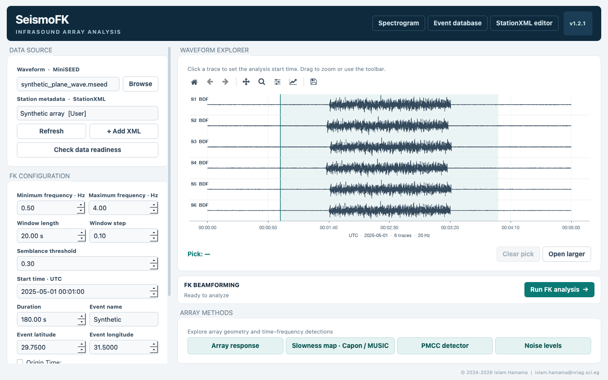<br>**Main window** | 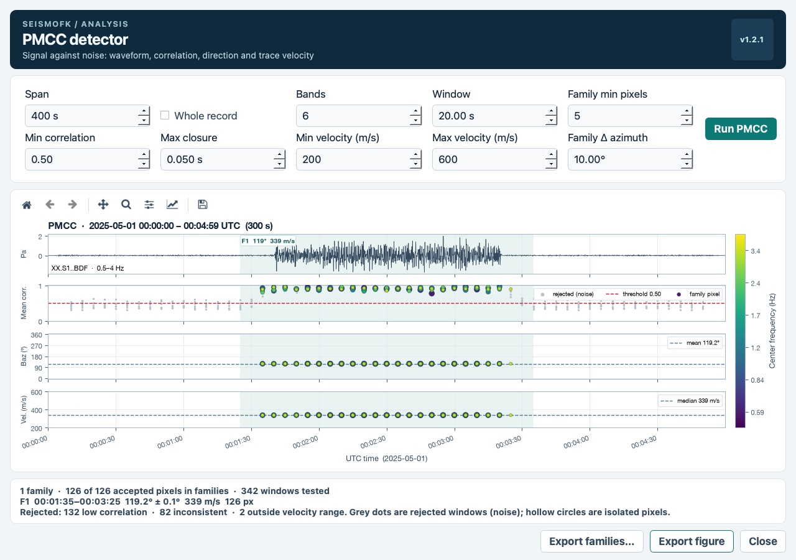<br>**PMCC detector with families** |
| 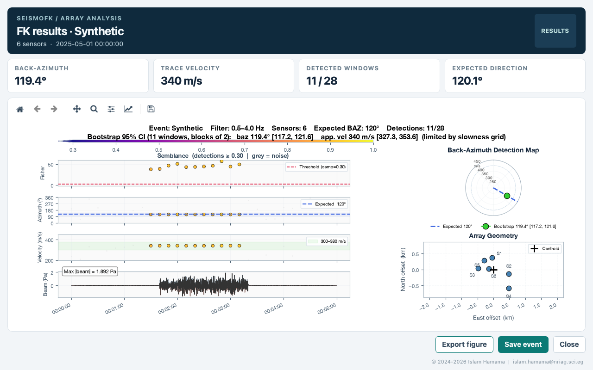<br>**FK results with bootstrap 95% CI** | 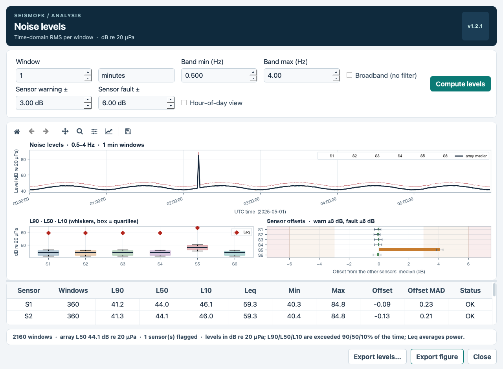<br>**Noise levels (dB re 20 µPa), sensor S5 flagged** |
| 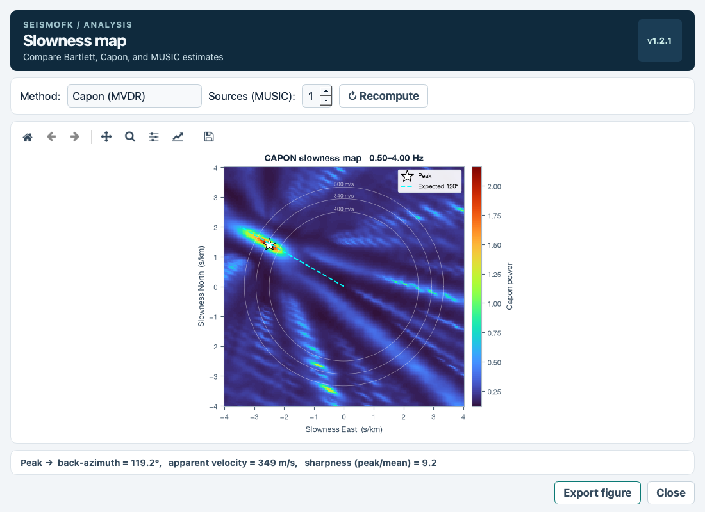<br>**Capon slowness map** | 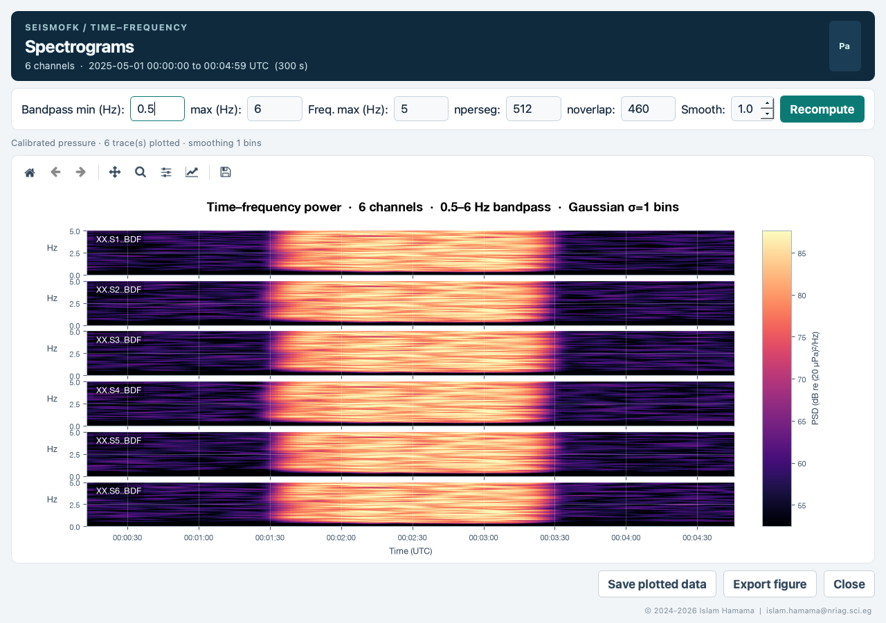<br>**Spectrogram (Pa)** |
| 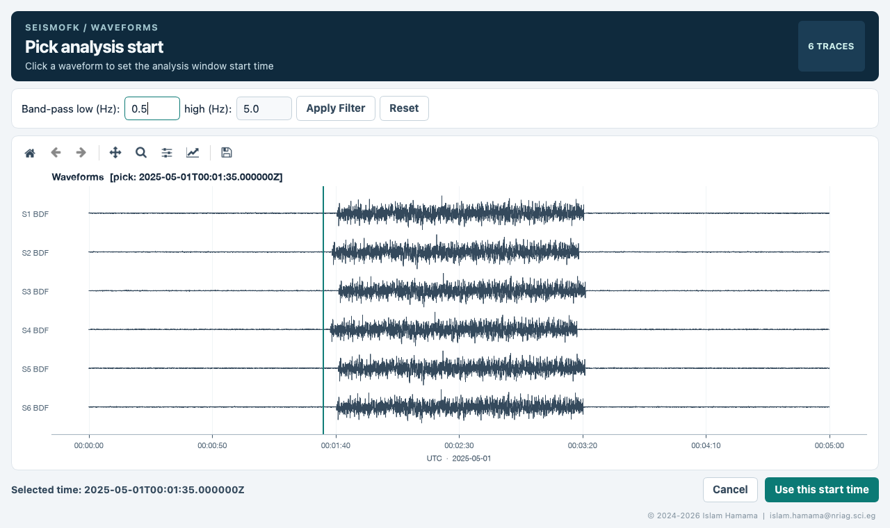<br>**Waveform picker** | 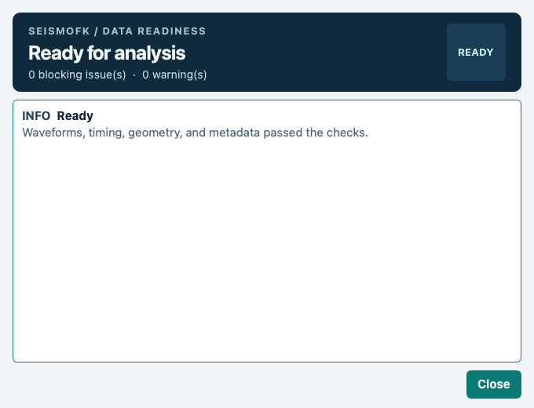<br>**Data readiness check** |
| 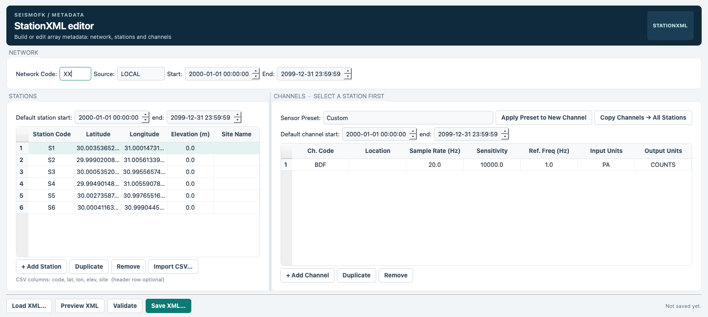<br>**StationXML editor** | 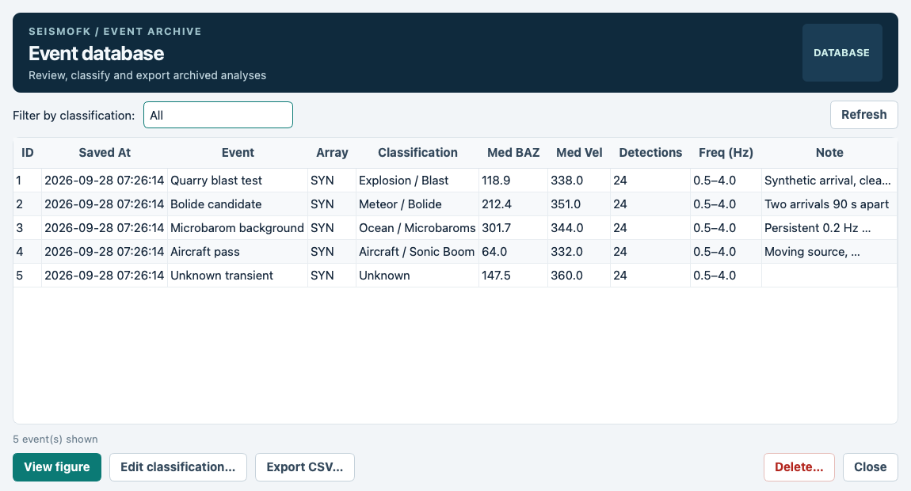<br>**Event database** |
| 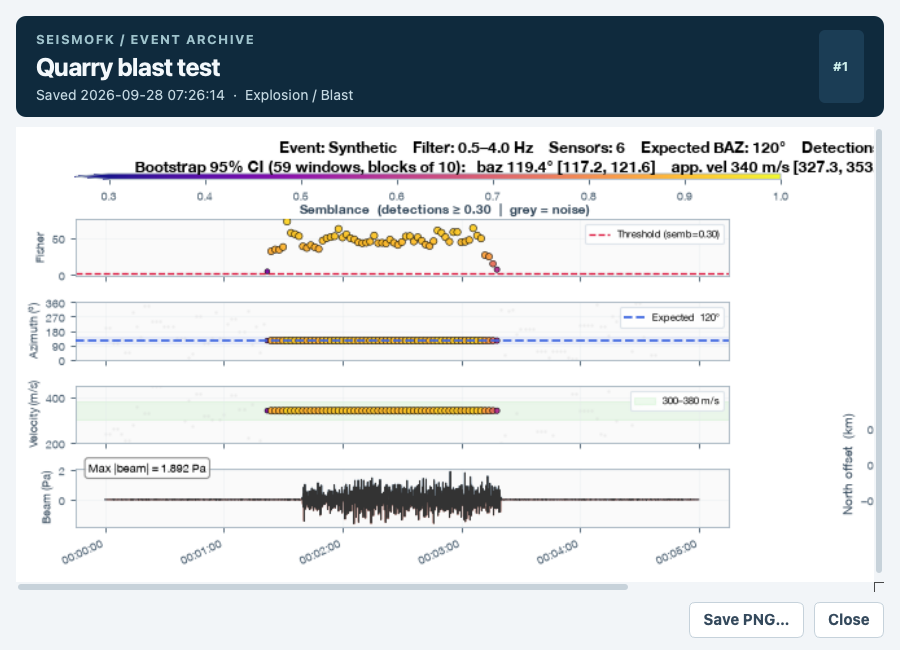<br>**Stored event figure** | 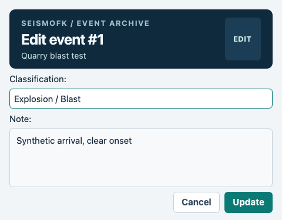<br>**Edit event dialog** |

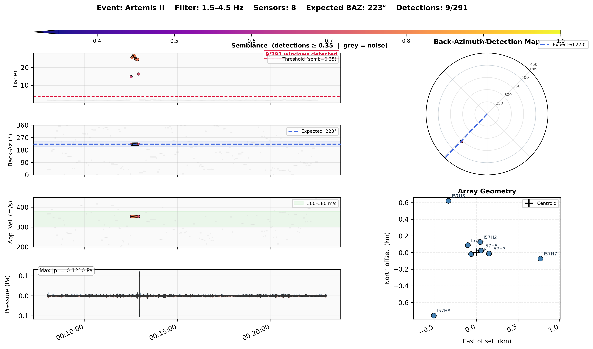
*Real-data example: FK result for the Artemis II Orion re-entry at I57US (produced with v1.2.0).*

---

## Prerequisites

- **Python 3.9 or newer** (3.10+ recommended).
- A desktop environment capable of running Qt applications (Windows, macOS, or Linux with a display server).

### Key dependencies

| Package | Version | Purpose |
|---|---|---|
| PyQt5 | `>=5.15, <6.0` | Desktop GUI |
| NumPy | `>=1.24` | Numerical processing |
| pandas | `>=2.0` | Tabular results / CSV output |
| matplotlib | `>=3.7` | Plotting (Qt5Agg backend) |
| ObsPy | `>=1.4` | MiniSEED I/O, StationXML, response removal, array processing |
| SciPy | `>=1.10` | Capon/MUSIC, PMCC correlation, bootstrap statistics, spectrogram |
| pyarrow | `>=12.0` | Parquet detection archive for the long-term CLI *(optional — falls back to CSV)* |

> SciPy is now a core dependency (used by the v1.2.1 methods and the spectrogram
> utility). **pyarrow** is only needed for Parquet output from `seismofk_cli.py`;
> without it the CLI transparently writes CSV instead.

---

## Installation

```bash
# 1. Clone the repository
git clone https://github.com/islam-hamama/SeismoFK.git
cd SeismoFK

# 2. (Recommended) create and activate a virtual environment
python -m venv .venv
source .venv/bin/activate        # Windows: .venv\Scripts\activate

# 3. Install the application and its required dependencies
pip install .
# Optional: pip install ".[parquet]" for Parquet archives
```

---

## Running SeismoFK

The application entry point is **`Infra_Analysis.py`**:

```bash
seismofk
```

This opens the main **SeismoFK — Infrasound FK Array Analysis** window.
Running `python Infra_Analysis.py` from a source checkout still works.

Added StationXML files and new event databases are stored in
`~/.seismofk/` by default. Set `SEISMOFK_DATA_DIR` to use another directory.
Existing `XML/`, `XML_IM/`, and `fk_events.db` beside the source files remain
available when running from a checkout.

> For a full, step-by-step walkthrough of every panel and tool, see **[USAGE.md](USAGE.md)**.

### Typical workflow

1. **Load data** — click *Browse* and select one or more MiniSEED files.
2. **Select an inventory** — choose a station XML from the *Inventory* dropdown (see the station-metadata section below).
3. **Pick a start time** — click the waveform preview to set the FK analysis start time, or set it manually.
4. **Set parameters** — minimum/maximum frequency, FK window length, window overlap, semblance threshold, analysis duration, event name, and the expected source latitude/longitude. Optionally enable *Origin Time* and *Celerity* to overlay the expected infrasound arrival.
5. **Run FK analysis →** — processing runs in a background thread (response removal → filtering → FK array processing → beamforming).
6. **Review results** — the results window shows the FK detections, the steered beam, and the array geometry. Export the figure at 300 DPI if needed.
7. **Save event** — classify the event (explosion, mining, volcanic, microbaroms, etc.) and archive it, with the figure, in the local SQLite database.

### Long-term batch analysis (command line)

For continuous monitoring over days, months or years, use the v1.2.1 batch
driver, which streams the time range in chunks and archives detections to
Parquet + JSON (see [README_v1.2.1.md](README_v1.2.1.md) and
[USAGE.md §7.4](USAGE.md#74-seismofk_clipy--long-term-batch-array-analysis)):

```bash
# High-resolution Capon FK, hourly chunks, with bootstrap uncertainty
python seismofk_cli.py \
    --mseed "data/2025-05/*.mseed" --inventory XML_IM/ \
    --start 2025-05-01T00:00:00 --end 2025-06-01T00:00:00 \
    --method capon --fmin 0.5 --fmax 4.0 \
    --win-length 30 --chunk 3600 \
    --array-name I31 --out-dir results/ --bootstrap

# PMCC-style detection pixels, 6 log-spaced bands
python seismofk_cli.py --mseed data/ --inventory XML_IM/ \
    --start 2025-05-01 --end 2025-05-02 \
    --method pmcc --fmin 0.1 --fmax 8.0 --pmcc-bands 6 \
    --win-length 30 --array-name I31 --out-dir results/
```

---

## Station metadata (XML inventories)

The repository includes StationXML inventories for the IMS infrasound arrays in **`XML_IM/`** (I01AR–I60US), converted from FDSN StationXML with `convert_ims.py`. They are provided as-is. Check that each station's epochs and sensitivities suit your analysis: some, such as I48TN, contain overlapping epochs, and SeismoFK resolves those to the most recent calibration and reports it in **Check data readiness**. Your own files in `XML/` are not tracked by Git.

**You can supply your own.** Two options:

1. Run `python convert_ims.py` against your own `all_IMS_sts.xml` (FDSN StationXML) to generate per-station files in `XML_IM/`.
2. Use the built-in **XML Creator** tool (`xml_creator.py`) to define custom stations interactively.

Place generated files in `XML/` or `XML_IM/` next to `Infra_Analysis.py`; the app auto-discovers them on startup.

### How auto-discovery works

On startup (and whenever you click *Refresh*), SeismoFK scans two directories next to `Infra_Analysis.py` and populates the *Inventory* dropdown:

- **`XML_IM/`** — intended for IMS / multi-station array inventories. If this directory contains any `.xml` files, a single **"★ All IMS Stations (XML_IM/)"** entry is added first; selecting it loads and merges *every* `.xml` file in the directory into one combined inventory. Each individual file in `XML_IM/` is also listed separately, tagged `[IMS]`.
- **`XML/`** — for individual / custom station files. Each `.xml` file is listed as its own entry.

The **+ Add XML** button copies a chosen StationXML file into `~/.seismofk/XML/`
and refreshes the list. The XML Creator also saves there by default. Existing
`XML/` and `XML_IM/` files in a checkout remain discoverable. When an entry
points to a directory, SeismoFK merges its XML files at analysis time.

`convert_ims.py` defaults to `all_IMS_sts.xml` and `XML_IM/` beside the script; pass a source file and `-o` to override them.

---

## Supporting tools and modules

| File | Role |
|---|---|
| `Infra_Analysis.py` | Main application and GUI entry point. |
| `fk_analysis.py` | Core FK / beamforming routines (`fk_array`, `compute_beam`, inventory loading, coordinate lookup) **plus the v1.2.1 high-resolution beamformers** (`fk_beamform`: Capon/MUSIC/Bartlett), windowed scanner (`fk_scan`), bootstrap (`bootstrap_beam`) and array response (`array_response`). |
| `pmcc.py` | **(v1.2.1)** Progressive Multi-Channel Correlation detector for infrasound (`pmcc`, `log_bands`). |
| `results_io.py` | **(v1.2.1)** Parquet + JSON-sidecar + `index.csv` writers for the long-term detection archive. |
| `seismofk_cli.py` | **(v1.2.1)** Command-line batch driver for long-term analysis (`bartlett` / `capon` / `music` / `pmcc`). |
| `gui_methods.py` | **(v1.2.1)** GUI dialogs for the new methods — Array Response, Capon/MUSIC slowness map, and the PMCC detector window. |
| `xml_creator.py` | Standalone StationXML Creator / Editor — also launchable from the main window. Supports multi-station arrays, per-channel sensitivity, sensor presets, loading/editing existing XMLs and CSV import. |
| `convert_ims.py` | Converts a combined `all_IMS_sts.xml` FDSN StationXML into one XML file per IMS station in `XML_IM/`. |
| `export_stations.py` | Alternative IMS station splitter that exports individual stations from `all_IMS_sts.xml`. |
| `db_manager.py` | SQLite persistence layer for archived events (`fk_events.db`), including the event classification vocabulary and schema. |
| `plot_spectrogram_window.py` | Standalone spectrogram plotting utility for supplementary signal inspection. |

The **XML Creator** can also be opened directly:

```bash
python xml_creator.py
```

---

## Output files

- **`Output_<event>.csv`** — per-window FK results (time, semblance, FK power, Fisher ratio, back-azimuth, apparent velocity, slowness), written for each analysis run.
- **`fk_events.db`** — local SQLite database of archived, classified events (created on first save).
- Exported figures — PNG / PDF / SVG at 300 DPI, saved on demand from the results window.

---

## License

Released under the **MIT License** — see [LICENSE](LICENSE).


---

## Citing SeismoFK

If you use SeismoFK in your research, please cite it. Citation metadata is provided in [`CITATION.cff`](CITATION.cff) (Citation File Format 1.2.0); GitHub renders this as a *"Cite this repository"* button.

[](https://doi.org/10.5281/zenodo.20301795)

**Please cite SeismoFK with this single reference, whatever version you use:**

> Hamama, I. (2026). *SeismoFK* [Computer software]. Zenodo. https://doi.org/10.5281/zenodo.20301795

This DOI never changes and always opens the latest release, where every version is listed.

---

## Author

**Islam Hamama**
National Research Institute of Astronomy and Geophysics (NRIAG), Egypt
Contact: islam.hamama@nriag.sci.eg

### Acknowledgements

The array-processing methodology in `fk_analysis.py` is adapted in part from work by **Jelle Assink** (KNMI) — see the [ROSES 2021 array processing material](https://github.com/roseseismo/roses2021/blob/main/unit08/array_processing.py).
